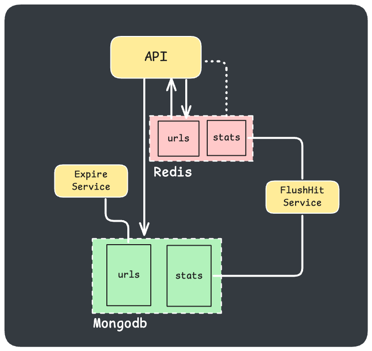

# URL Shortening Service

1. [Architecture](#architecture)
    - [API Layer](#api-layer)    
    - [Logic Layer](#logic-layer)    
    - [Data Store](#data-store)
    - [Caching Layer](#caching-layer)    
    - [Async Workers ](#async-workers)    
2. [API Design](#api-design)
    - [POST /api/shorten](#post-apishorten)
    - [GET /{short_url}](#get-short_url)
    - [GET /api/stats/{short_url}](#get-apistatsshort_url)
3. [Core Design Decisions](#core-design-decisions)
    - [Data Store Schema](#data-store-schema)
    - [Caching Layer](#caching-layer-1)
4. [Async Workers](#async-workers)
    - [Expire Service](#expire-service)
    - [FlushHits Service](#flushhits-service)
5. [Scalability](#scalability)


## Architecture



### API Layer
Exposes endpoints to shorten URLs, redirect to original URLs, and fetch analytics.

### Logic Layer
Contains the logic for URL shortening, cleanup, and analytics.

### Data Store
Stores the mappings between short URLs and long URLs, plus the access analytics.

### Caching Layer
Stores short URLs in-memory for fast lookups (to improve performance).

### Async Workers
- Expire Service - handles removal of old URL mappings.
- FlushHits Service - handles flushing hits count to persistent db. 

## API Design


### POST /api/shorten
Shortens a given long URL and returns the corresponding short URL.

Request
```
POST /api/shorten

{ 
    "long_url": "http://example.com" 
}
```

Response
```
{ 
    "short_url": "http://short.ly/abcd123" 
}
```


### GET /{short_url}


Redirects the user to the long URL corresponding to the short URL.

Request
```
GET /abcd123
```

Response
```
Redirect to http://example.com
```


### GET /api/stats/{short_url}


Returns analytics for a specific short URL (e.g., number of accesses).

Request
```
GET /api/stats/abcd123
```

Response
```
{ 
    "hits": 100 
}
```

## Core Design Decisions

### Data Store Schema
- **URL Mapping** - A mapping between the short URL and the original long URL.
- **Statistics** - For analytics, we need to track how many times a short URL is accessed.


#### `urls` Collection
- `_id`: Unique ID for each entry.
- `short_url`: Unique identifier (e.g., abcd123).
- `url`: The original long URL.
- `created_at`: Timestamp when the short URL was created.

#### `stats` Collectoin
- `_id`: Unique ID for each entry.
- `url`: Shortened url unique id.
- `hits`: The number of times this short URL was hit.


### Caching Layer
- Cache short URL to long URL mappings for faster redirection lookups.
- Cache the mappings for a short duration (e.g., 10 seconds), and every time we perform a redirect, we update the analytics data (e.g., increment the hits count).


## Async Workers
### Expire Service
Standalone process that expires old URL mappings and performs a cleanup in the system.
- loop every 3 seconds and perform clean up if old records found
- scan the `urls` collection while filtering for records older than 15 minutes
- loop over found records
- delete each record from `urls` and `stats` collection, then invalidate cache in redis if exists


### FlushHits Service
Standalone process that collects hits aggregated in **redis** and flushes the stats to **mongodb**.
- loop every 3 seconds and perform write to **mongodb** if new keys found
- scan redis with match `stats:*`
- loop over found keys
- write each one to relevant record in `stats` collection, then delete the keys in **redis**


## Scalability
To ensure scalability and handling high traffic rate, a few measures we're taken when designing and implementing persistence for access analytics and mapping retrieval:

- **Batching** - analytic access events are handled during redirect logic in a separate goroutine and stored (aggregated) in redis using the INCR command, then a separate process (worker) collects the keys from **redis** and writes them to **mongodb** in batches.
- **Cache Aside** - caching for url mapping is implemented during redirect logic in a lazy loading (cache-aside) strategy while also setting a TTL on keys to avoid utilizing too much memory in cache as well as avoid overloading **mongodb**  with mapping retrievals.
- **Rate Limit** TODO: rate limit `/api/shorten` endpoint to avoid overloading the database with INSERTS and using too much storage.
